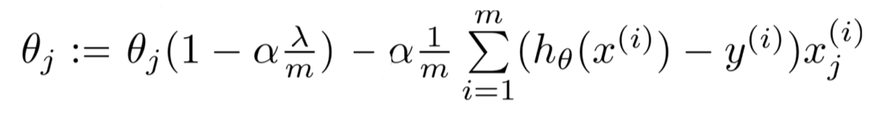

# my own simple linear regression
this is my attempt at creating a linear regression model from scratch  
The model should have the same user interface as sklearn  
model = LinearRegression()  
model.fit(X, Y)  

The only external Resource for this Implementation is the following Formula for regularized Gradient descent, taken from the Original Machine Learning Course from Andrew NG

